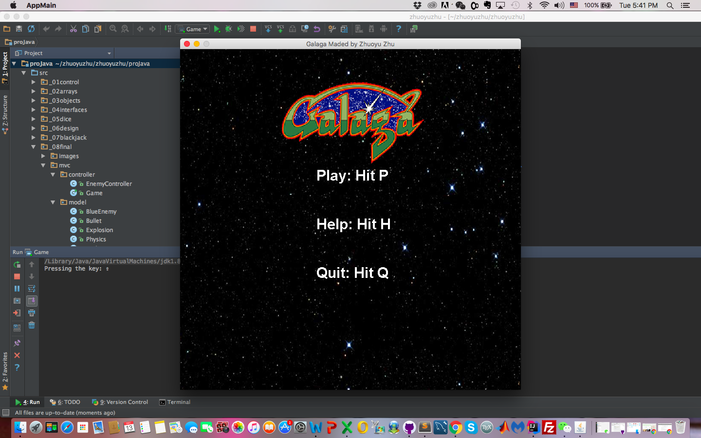
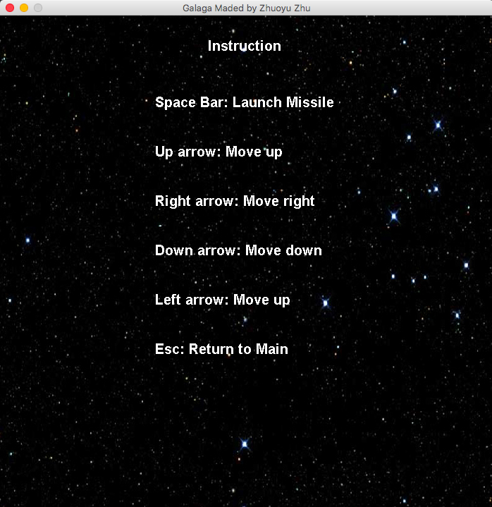
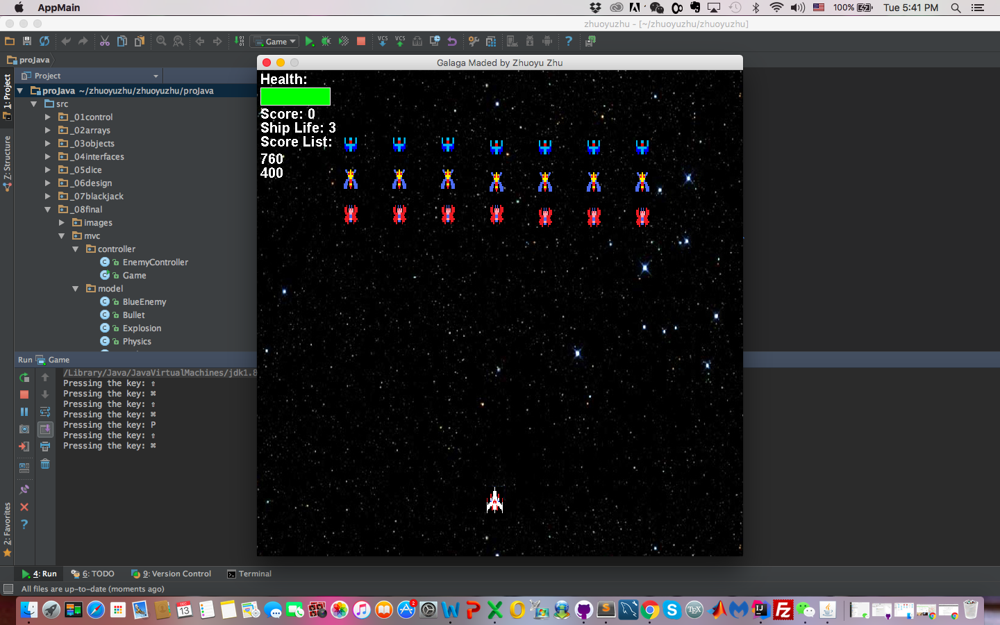
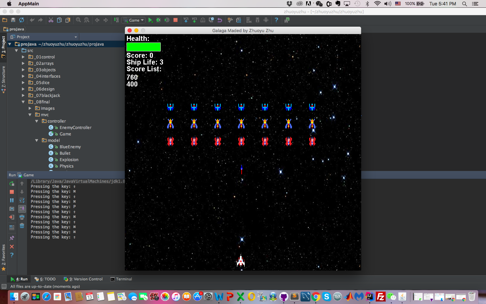

# MPCS51036-Multi-Threaded-Galaga
This is my MPCS51036 Java Programming final project about developing a multi-threaded game, Galaga in MVC model(http://arcadegamesclassic.net/galaga/index.php?act=Arcade&do=newscore#.WC0Q86PMzOY).

Features implemented:
1. The ship is able to move in vertical, horizontal, diagonal direction.

2. Display how many ships player has left before the game is over. 

3. Have the yellow, red and blue fighters (i.e. the enemies) move in formation across the screen.

4. If a bullet or fighter collides with the space-ship then that should kill the ship and remove one life from the
players' lives. In the actual game, the player has three lives before the game is over.

5. The ship can also fire bullets which can be moved in a linear movement upwards and diagonally. If the bullet hits a ship then
the player should gain a few points. 

6. The highest top 10 scores were also shown on the left side of game panel.

7. Instruction panel shows the manual about controlling warship.

8. Health bar feature was implemented so if the ship was hitted by enemies, it will lose some health points.

9. Sound effects were added when the game starts, the ship fires missiles, the ship elminiates one enemy and the ship collides with enemies.

10. Animation was also added for ship and enemyies explosion.
Etc:............

## 1. Game Start

## 2. Instruction manual

## 3. Game status

## 4. Firing Missiles

